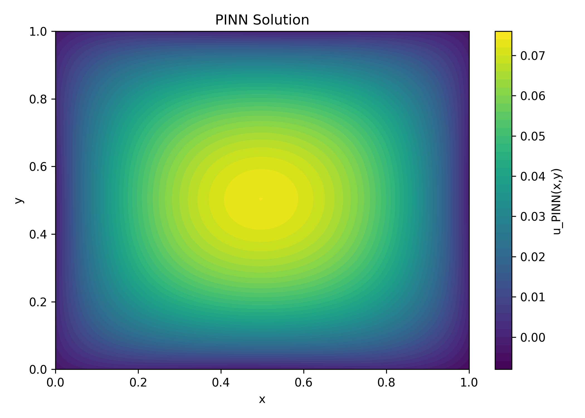
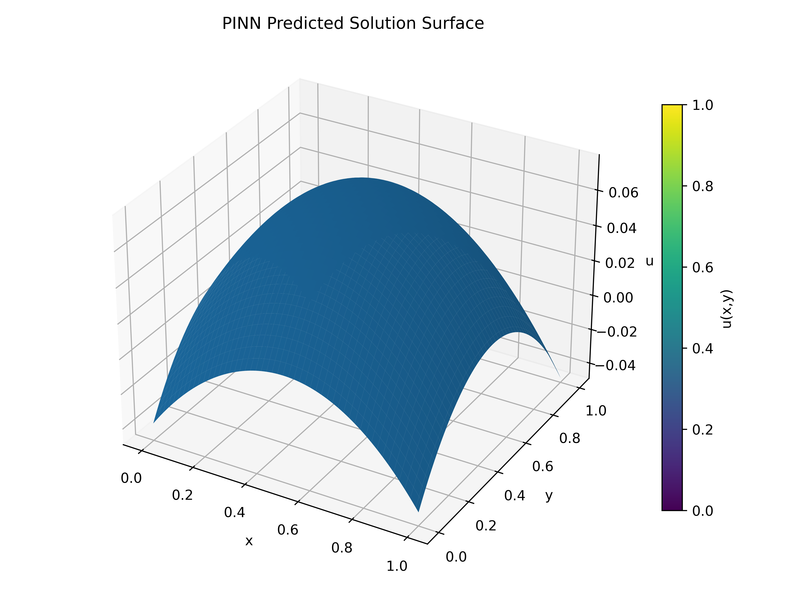
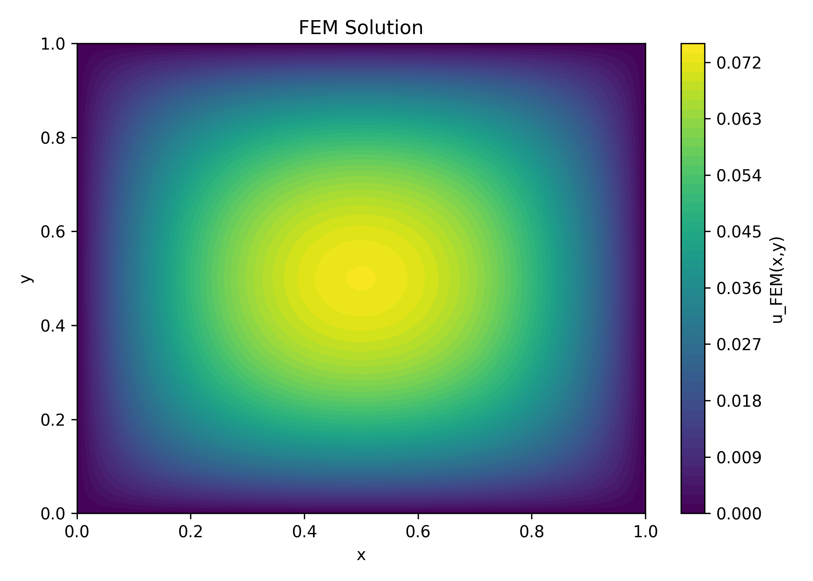
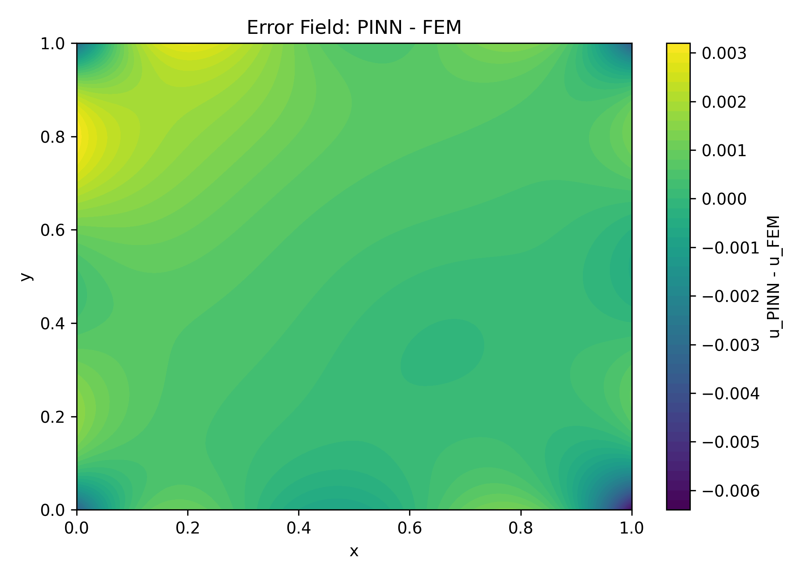
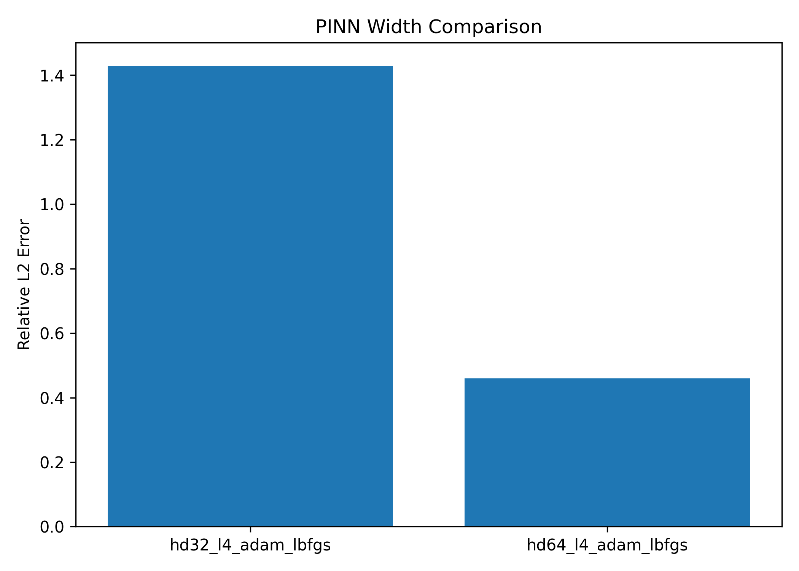
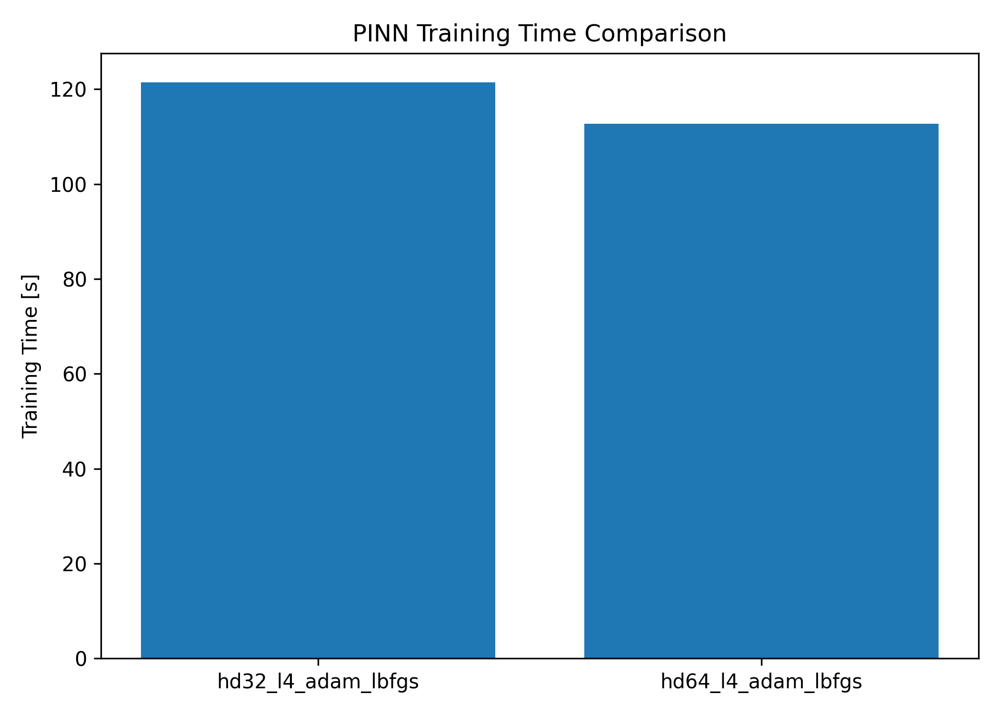
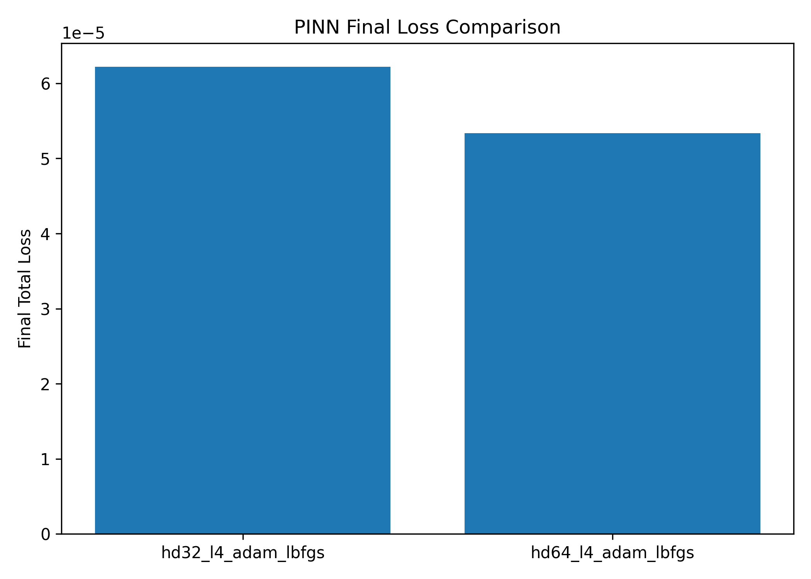

# Physics-Informed Neural Network (PINN) Solver for the 2D Poisson Equation

This project implements a **Physics-Informed Neural Network (PINN)** in Python using **PyTorch** to solve the **2D Poisson equation** on a unit square domain.

The solution is validated against a classical **Finite Element Method (FEM)** solver, and controlled experiments are performed to compare network architectures and optimization strategies.

The project demonstrates how **machine learning can be integrated into scientific computing workflows** for solving physics-based engineering problems.

---

# Motivation

Traditional numerical methods such as the **Finite Element Method (FEM)** are widely used in **computational mechanics**, **heat transfer**, and **engineering simulation**.

However, modern engineering workflows increasingly integrate **machine learning**, **scientific AI**, and **data-driven modeling**.

**Physics-Informed Neural Networks (PINNs)** provide an alternative approach in which the governing physics is built directly into the training objective.

This project was developed to:

- understand how neural networks can solve PDEs
- compare PINNs with a trusted FEM reference
- explore **GPU-based scientific computing**
- study the effect of model architecture and optimization strategy on solution accuracy
- demonstrate reproducible numerical experiments for physics-based machine learning

---

# What is a Physics-Informed Neural Network (PINN)?

A **Physics-Informed Neural Network** is a neural network trained not only on data, but also on the **physical laws** that govern the system.

Instead of learning from labeled input-output pairs, the model is trained to satisfy the **differential equation residual** and the **boundary conditions**.

In simple terms:

```text
Neural Network + Governing Equations + Boundary Conditions = Physics-Informed Model
```

PINNs are useful in:

- **heat transfer**
- **fluid dynamics**
- **structural mechanics**
- **computational physics**
- **inverse problems**
- **scientific machine learning**

---

# Problem Description

We solve the **2D Poisson equation**:

```text
-∇²u = 1        in Ω
u = 0            on ∂Ω
```

where:

- **u(x, y)** : scalar field
- **Ω** : computational domain
- **∂Ω** : boundary

In this project:

**Domain:**

```text
Ω = [0, 1] × [0, 1]
```

**Source:**

```text
f = 1
```

---

# Why PINNs for Physics Problems?

PINNs are attractive because they allow us to solve PDEs using a **mesh-free learning-based formulation**.

Compared with classical numerical methods, they offer several advantages in certain scenarios:

- no explicit mesh generation during training
- direct use of **automatic differentiation**
- flexible handling of unknown fields
- natural extension to inverse and data-assimilation problems
- integration with modern AI workflows

At the same time, they must be carefully validated against classical methods such as FEM.

That is why this project includes a full **PINN vs FEM comparison**.

---

# Method Overview

The neural network approximates the scalar field:

```text
u(x, y)
```

The total loss is defined as:

```text
Total Loss = PDE Residual Loss + λ × Boundary Loss
```

where:

- **PDE Residual Loss** enforces the Poisson equation
- **Boundary Loss** enforces the Dirichlet condition
- **λ** controls the weight of the boundary term

The model uses **automatic differentiation** to compute:

- first derivatives
- second derivatives
- Laplacian-based PDE residuals

---

# Model Architecture

The PINN takes spatial coordinates as input:

```text
(x, y) → u(x, y)
```

A typical configuration used in this project:

- **input dimension** = 2
- **hidden layers** = 4
- **hidden dimension** = 32 or 64
- **activation function** = **Tanh**
- **output dimension** = 1

The architecture was intentionally kept simple and interpretable so that the impact of width and optimization strategy could be studied clearly.

---

# Training Strategy

Training was performed in two stages:

## Stage 1: Adam

The **Adam optimizer** was used first to obtain a stable initial solution and reduce the loss quickly.

## Stage 2: LBFGS

The **LBFGS optimizer** was then used for refinement.

This two-stage strategy improved convergence and reduced the final PDE residual.

---

---

# PINN Solution Visualization

## Predicted Solution (Contour)



---

## Predicted Solution Surface



---

# FEM Reference Solution

The reference solution was generated using an independently implemented **Finite Element Method (FEM)** solver with **triangular elements**.

This FEM solution is used as a trusted numerical baseline for validation.

## FEM Solution



---

# PINN vs FEM Error Field

The error field below shows the difference between the PINN prediction and the FEM reference solution.



---

# Key Results

After tuning the architecture and training strategy, the PINN achieved strong agreement with the FEM solution.

A representative result obtained in this project:

- **L2 error** = `8.621377e-04`
- **Relative L2 error** = `2.110733e-02`
- **Max error** = `6.272102e-03`

This shows that the trained PINN is **qualitatively correct** and also **quantitatively accurate**.

---

# Architecture Comparison

A controlled experiment was performed to compare two model widths:

- **hidden_dim = 32**
- **hidden_dim = 64**

All other settings were kept fixed:

- same PDE
- same domain
- same boundary conditions
- same collocation strategy
- same optimization schedule
- same FEM reference

This makes the comparison fair and reproducible.

---

## Relative L2 Error Comparison



---

## Training Time Comparison



---

## Final Loss Comparison



---

# Controlled Experiment Summary

The experiment showed that increasing the hidden dimension from **32** to **64** significantly improved solution accuracy.

Main observation:

- **hidden_dim = 64** achieved lower final loss
- **hidden_dim = 64** achieved lower FEM error
- training time remained comparable

This demonstrates the expected tradeoff between **model capacity** and **numerical accuracy** in PINN-based solvers.

---